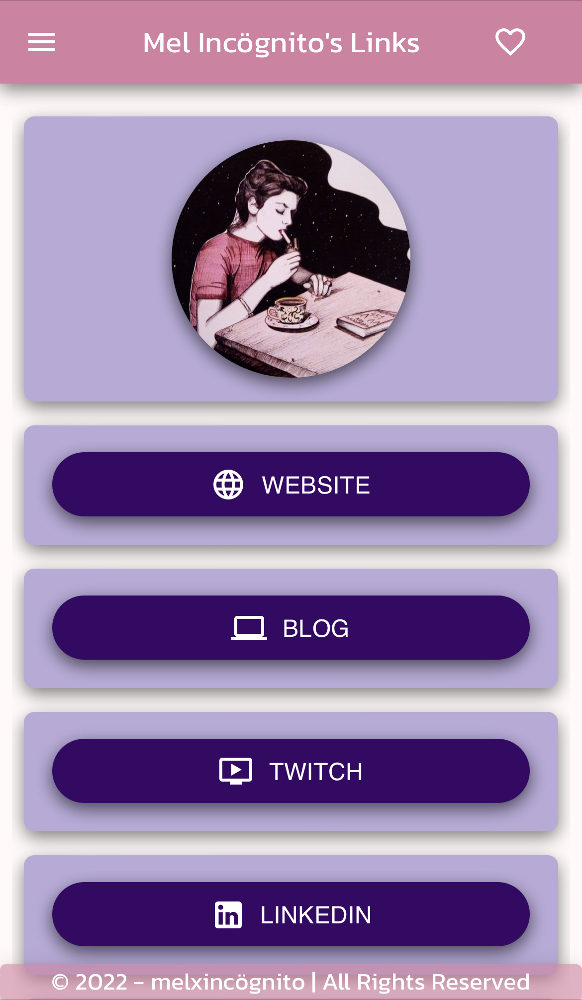

# Mels Linktree

## Overview

<ul>
<li> My LinkTree clone to use for my sites and socials. </li>
</ul>

## Preview

[See live application](https://www.links-melxincognito.com/)



## Getting Started

### 1. Clone the repository and install the dependencies using NPM.

```
git clone https://github.com/melxincognito/mels-linktree.git
cd mels-linktree
npm i
```

### 2. Run the app locally

```
npm start
```

### 3. View application locally

Open your browser to <b>localhost:3000</b> to view the application locally

## Components

<h3>CardButton </h3>

<ul>
<li>Creates the button for the link</li>
</ul>

<h3>UIBox </h3>

<ul>
<li>Creates the card containing each link button</li>
</ul>

<h3>IntroCard </h3>

<ul>
<li>Creates the top intro card containing my header image</li>
</ul>

<h3> Links</h3>

<ul>
<li>Links content where I take in the UIBox and CardButton to create all the
components for each social link </li>
</ul>
